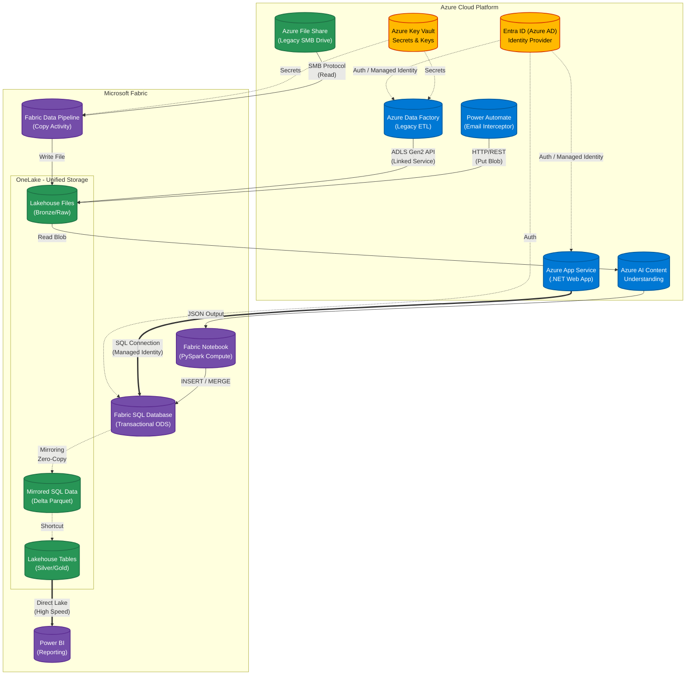

# Azure & Fabric Hybrid Architecture Diagram

```mermaid
graph TD
    %% --- Styles ---
    classDef azure fill:#0078D4,stroke:#005A9E,stroke-width:2px,color:white;
    classDef fabric fill:#744DA9,stroke:#5C2D91,stroke-width:2px,color:white;
    classDef storage fill:#289556,stroke:#1E7145,stroke-width:2px,color:white;
    classDef security fill:#FFB900,stroke:#D83B01,stroke-width:2px,color:black;

    %% --- Azure Cloud Environment ---
    subgraph Azure_Cloud [Azure Cloud Platform]
        direction TB
        EntraID[("Entra ID (Azure AD)<br>Identity Provider")]:::security
        KeyVault[("Azure Key Vault<br>Secrets & Keys")]:::security
        
        WebApp[("Azure App Service<br>(.NET Web App)")]:::azure
        ADF[("Azure Data Factory<br>(Legacy ETL)")]:::azure
        FileShare[("Azure File Share<br>(Legacy SMB Drive)")]:::storage
        
        PowerAuto[("Power Automate<br>(Email Interceptor)")]:::azure
        AzureAI[("Azure AI Content<br>Understanding")]:::azure
    end

    %% --- Microsoft Fabric Environment ---
    subgraph Fabric_Cloud [Microsoft Fabric]
        direction TB
        
        subgraph OneLake_Storage [OneLake - Unified Storage]
            LakeFiles[("Lakehouse Files<br>(Bronze/Raw)")]:::storage
            LakeTables[("Lakehouse Tables<br>(Silver/Gold)")]:::storage
            MirroredData[("Mirrored SQL Data<br>(Delta Parquet)")]:::storage
        end
        
        FabricSQL[("Fabric SQL Database<br>(Transactional ODS)")]:::fabric
        FabPipeline[("Fabric Data Pipeline<br>(Copy Activity)")]:::fabric
        Notebook[("Fabric Notebook<br>(PySpark Compute)")]:::fabric
        PowerBI[("Power BI<br>(Reporting)")]:::fabric
    end

    %% --- Connections & Handshakes ---
    
    %% 1. Identity & Security
    EntraID -.->|Auth / Managed Identity| WebApp
    EntraID -.->|Auth / Managed Identity| ADF
    EntraID -.->|Auth| FabricSQL
    KeyVault -.->|Secrets| ADF
    KeyVault -.->|Secrets| FabPipeline

    %% 2. Web App Flow
    WebApp == "SQL Connection<br>(Managed Identity)" ==> FabricSQL
    FabricSQL -.->|Mirroring<br>Zero-Copy| MirroredData

    %% 3. File Share Sync
    FileShare -- "SMB Protocol<br>(Read)" --> FabPipeline
    FabPipeline -- "Write File" --> LakeFiles

    %% 4. ADF Legacy Flow
    ADF -- "ADLS Gen2 API<br>(Linked Service)" --> LakeFiles

    %% 5. AI / Email Flow
    PowerAuto -- "HTTP/REST<br>(Put Blob)" --> LakeFiles
    LakeFiles -- "Read Blob" --> AzureAI
    AzureAI -- "JSON Output" --> Notebook
    Notebook -- "INSERT / MERGE" --> FabricSQL

    %% 6. Analytics & Reporting
    MirroredData -.->|Shortcut| LakeTables
    LakeTables == "Direct Lake<br>(High Speed)" ==> PowerBI

    %% --- Layout Adjustments ---
```