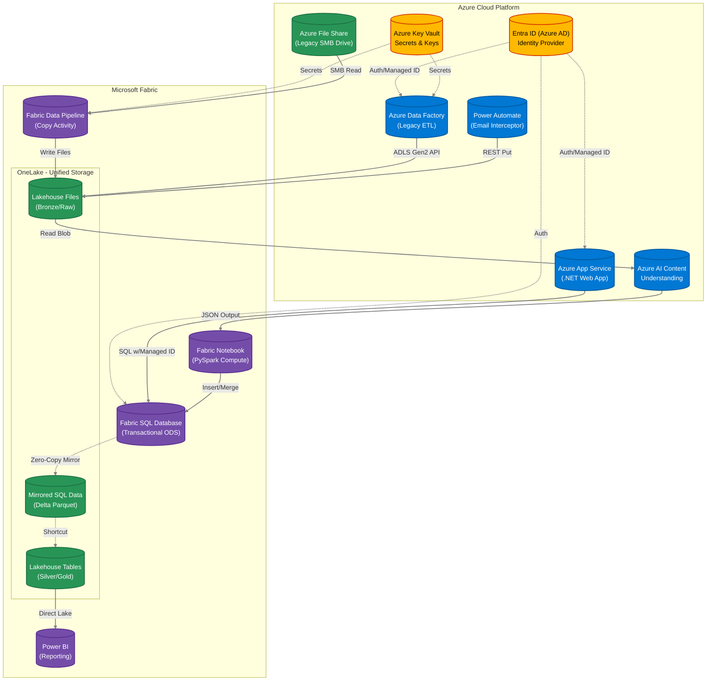

# Azure & Fabric Hybrid Architecture Diagram

## Architecture Flow

- **Entra ID**: Manages identity and authentication across Azure & Fabric
- **Key Vault**: Stores secrets and connection strings securely
- **Web App**: Legacy .NET application with managed identity auth
- **Data Factory**: Legacy ETL processes and data movement
- **Power Automate**: Automated workflow for email interception
- **Azure AI**: Content understanding and document processing
- **OneLake**: Unified storage layer (Bronze/Silver/Gold layers)
- **Fabric SQL**: Transactional database with zero-copy mirroring
- **Fabric Pipeline**: Modern data pipeline for orchestration
- **Notebook**: PySpark compute for data transformation
- **Power BI**: Analytics and reporting layer
