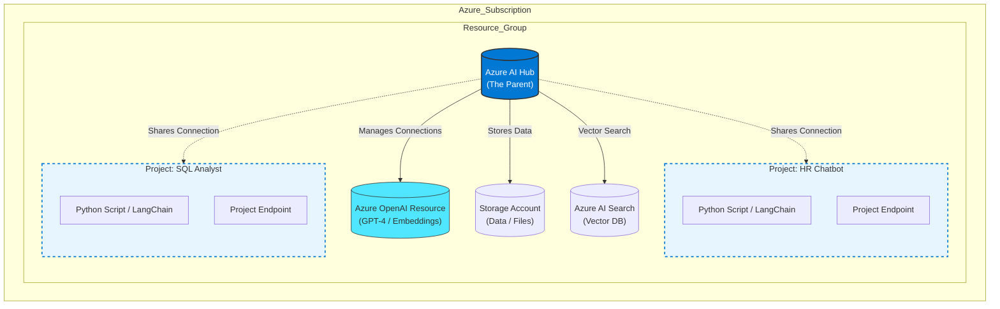

```mermaid
graph TD
    subgraph Azure_Subscription
        subgraph Resource_Group
            Hub[("Azure AI Hub<br>(The Parent)")]
            
            %% The Shared Resources (Connected to Hub)
            AOAI[("Azure OpenAI Resource<br>(GPT-4 / Embeddings)")]
            Storage[("Storage Account<br>(Data / Files)")]
            Search[("Azure AI Search<br>(Vector DB)")]
            
            Hub -- "Manages Connections" --> AOAI
            Hub -- "Stores Data" --> Storage
            Hub -- "Vector Search" --> Search
            
            %% The Projects (Children)
            subgraph Project_A ["Project: HR Chatbot"]
                CodeA["Python Script / LangChain"]
                 EndpointA["Project Endpoint"]
            end
            
            subgraph Project_B ["Project: SQL Analyst"]
                CodeB["Python Script / LangChain"]
                EndpointB["Project Endpoint"]
            end
            
            %% Inheritance
            Hub -. "Shares Connection" .-> Project_A
            Hub -. "Shares Connection" .-> Project_B
        end
    end

    style Hub fill:#0078D4,stroke:#333,stroke-width:2px,color:white
    style AOAI fill:#50e6ff,stroke:#333,stroke-width:1px
    style Project_A fill:#e6f5ff,stroke:#0078D4,stroke-width:2px,stroke-dasharray: 5 5
    style Project_B fill:#e6f5ff,stroke:#0078D4,stroke-width:2px,stroke-dasharray: 5 5
```