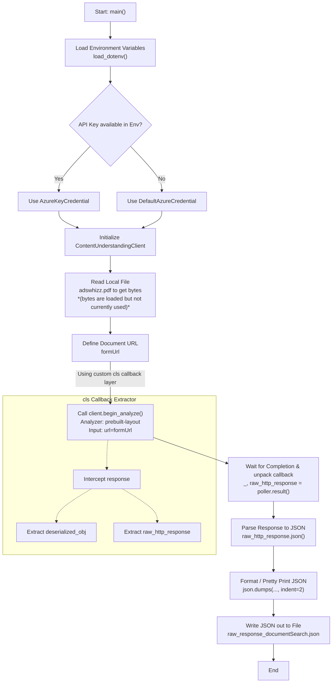

```mermaid
flowchart TD
    A["Start: main()"] --> B["Load Environment Variables<br>load_dotenv()"]
    B --> C{"API Key available in Env?"}
    C -->|Yes| D["Use AzureKeyCredential"]
    C -->|No| E["Use DefaultAzureCredential"]
    D --> F["Initialize ContentUnderstandingClient"]
    E --> F
    
    F --> G["Read Local File<br>adswhizz.pdf to get bytes<br>*(bytes are loaded but not currently used)*"]
    G --> H["Define Document URL<br>formUrl"]
    
    H -->|"Using custom cls callback layer"| I["Call client.begin_analyze()<br>Analyzer: prebuilt-layout<br>Input: url=formUrl"]
    
    subgraph Extractor ["cls Callback Extractor"]
        I -.-> Z["Intercept response"]
        Z -.-> Y["Extract deserialized_obj"]
        Z -.-> X["Extract raw_http_response"]
    end

    I --> L["Wait for Completion & unpack callback<br>_, raw_http_response = poller.result()"]
    L --> N["Parse Response to JSON<br>raw_http_response.json()"]
    N --> O["Format / Pretty Print JSON<br>json.dumps(..., indent=2)"]
    O --> P["Write JSON out to File<br>raw_response_documentSearch.json"]
    P --> Q["End"]
```
